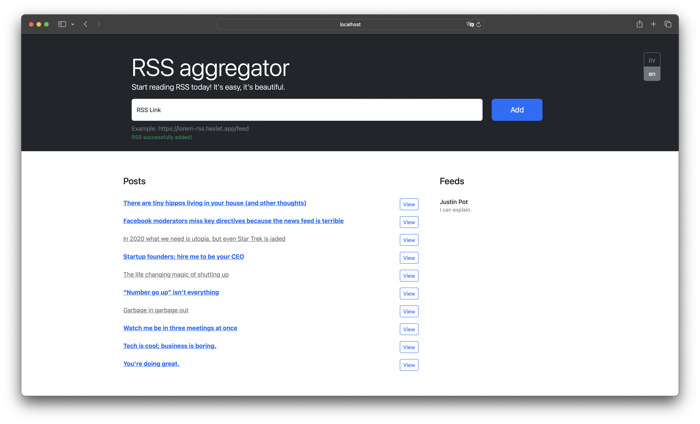

# RSS Aggregator

[](https://github.com/bdcry/frontend-project-11/actions) - Hexlet tests and linter status.

[](https://github.com/bdcry/frontend-project-11/actions/workflows/lint-check.yml) - Linter check status.

[](https://codeclimate.com/github/bdcry/frontend-project-11/maintainability) - Оценка Maintainability от Codeclimate.

## Описание проекта

**RSS Aggregator** — это сервис для агрегации RSS-потоков, который позволяет удобно читать различные источники, такие как блоги, новостные сайты и т.д. Пользователи могут добавлять неограниченное количество RSS-лент, сервис автоматически обновляет ленты и отображает новые записи в удобном виде.

Этот проект фокусируется на работе с чистым DOM API, управлением состоянием приложения, обработкой асинхронных запросов и валидацией данных. В рамках проекта реализован MVC-подход для упрощения поддержки и расширяемости приложения.

### Технический стек

- **Axios**
- **i18next**
- **Webpack**
- **Yup Validate**
- **Bootstrap**

## Цель

Этот проект был разработан для демонстрации следующих аспектов фронтенд-разработки:

- Работа с чистым DOM API для манипулирования HTML-структурой страницы.
- Разработка архитектуры на основе шаблона проектирования MVC.
- Асинхронное программирование с использованием промисов и обработка ошибок при выполнении HTTP-запросов.
- Валидация данных форм с использованием библиотеки Yup.
- Настройка сборки и автоматизации процессов с использованием Webpack.

## RSS Aggregator Скриншот



## Установка

1. Склонируйте репозиторий:

```sh
git clone https://github.com/bdcry/frontend-project-11.git
```

2. Перейдите в директорию проекта:
```sh
cd frontend-project-11
```

3. Установите зависимости:
```sh
npm install
```

4. Запустите проект:
```sh
npm start
```

5. Откройте в браузере:
```sh
http://localhost:8080
```

## Запуск через Makefile

1. Установка зависимостей:
```sh
make install
```

2. Линтинг кода:
```sh
make lint
```

3. Запуск в режиме разработки:
```sh
make develop
```

4. Сборка проекта:
```sh
make build
```

## Проект также доступен по следующей ссылке:

[RSS Aggregator на Vercel](https://frontend-project-11-bdcry.vercel.app/) - **Посетите развернутую версию проекта на Vercel**